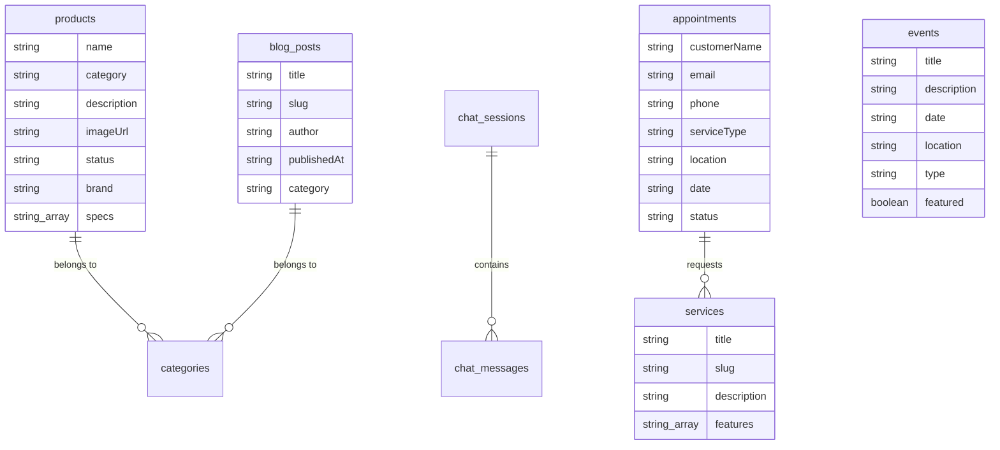

# Product Specification: Namtech Pro Platform

## 1. Project Overview
Namtech Pro is a high-performance technical catalog and service management platform designed for the maritime and technical sectors, primarily serving the Angolan market (Namibe, Luanda, Lobito). The platform serves as a bridge between elite technical equipment manufacturers and professional end-users, providing a streamlined experience for product exploration, service scheduling, and technical community engagement.

### 1.1 Purpose
To provide a premium, modern, and reliable digital presence that reflects the "Elite" status of the equipment and services provided by Namtech. The platform facilitates lead generation, customer support, and project showcase.

## 2. Target Audience
- **Maritime Professionals**: Ship owners, technical managers, and port operators.
- **Technical Engineers**: Professionals looking for specific technical specs and reliable equipment.
- **Industrial Clients**: Entities requiring maritime energy systems, radio maintenance, and control systems.
- **Local Communities**: Engaging with projects and technical events in coastal Angola.

## 3. Core Features

### 3.1 Product Catalog
- **Multi-Category Navigation**: Specialized categories including Navigation, Communication, Energy, and Control.
- **Detailed Specifications**: Comprehensive product details with technical specs, status (e.g., "New", "Available", "Top Seller"), and brand information.
- **Real-time Search & Filter**: Instant synchronization with the database for up-to-date inventory availability.
- **Premium Visualization**: High-quality imagery for all technical equipment.

### 3.2 Service Scheduling (Agendamento)
- **Service Types**: Maritime Energy Systems, Radio Maintenance, Naval Technology consultations.
- **Location-based Booking**: Choice of service location (Namibe, Luanda, Lobito).
- **Automated Workflow**: User-friendly form capturing customer details, desired service, date, and time.
- **Status Tracking**: Internal tracking of appointments (Pending, Confirmed, Completed, Cancelled).

### 3.3 Event & Project Management
- **Featured Projects**: Highlighting community impact and technical projects.
- **Event Listings**: Managing upcoming community and technical events.
- **Rich Content**: Support for detailed event descriptions and featured imagery.

### 3.4 Blog & Educational Content
- **Technical Insight**: Articles on the future of maritime operations and technical best practices.
- **Engagement Analytics**: Track read times and categories (Project, Community, Technology).

### 3.5 Real-time Support (Chat)
- **Hybrid Support**: Integrated chat system supporting both automated bot responses and human agent intervention.
- **Customer Identity**: Session-based chat tracking to provide personalized support.

### 3.6 Lead Capture
- **Integrated Forms**: Seamless contact forms across the site to convert interest into technical consultations.
- **Lead Management**: Structured data capture for sales follow-up.

### 3.7 Backoffice / Admin Panel
- **Content Management**: Dedicated area for authorized personnel to manage products, events, blog posts, and service requests.
- **User Management**: Secured access via Clerk authentication.

## 4. Database Schema (Convex)
The database is structured to handle real-time updates and relational-like queries using Convex.

## 5. Technical Stack

### Frontend
- **Framework**: Next.js (App Router)
- **Styling**: Tailwind CSS (v4)
- **Animations**: Framer Motion
- **Icons**: Lucide React
- **Authentication**: Clerk

### Backend & Infrastructure
- **Real-time Database**: Convex (Serverless)
- **Storage**: Convex File Storage / Vercel Blob
- **Edge Functions**: Convex Actions/Mutations

## 5. Information Architecture

### Main Sitemap
- **Home**: Hero section, Category quick-access, Featured products, News highlights.
- **Catalog**: Full inventory with category filtering.
- **Services**: Detailed descriptions of specialized technical services.
- **Scheduling**: Multi-step booking process.
- **Blog**: Educational and technical articles.
- **Projects/Events**: Showcase of community and technical achievements.
- **Backoffice**: Secured administrative area.

## 6. Design Principles
- **Aesthetic**: Premium, Elite, Technical, Clean.
- **Color Palette**: Primary (Navy/Pro-Blue), Secondary (Technical Orange/Accent), Clean White/Slate backgrounds.
- **Typography**: Bold display fonts for headings, clean sans-serif for technical data.
- **Responsiveness**: Mobile-first design for technical staff in the field.

---
*Document Version: 1.0*
*Created for: Namtech Pro Development Team*
